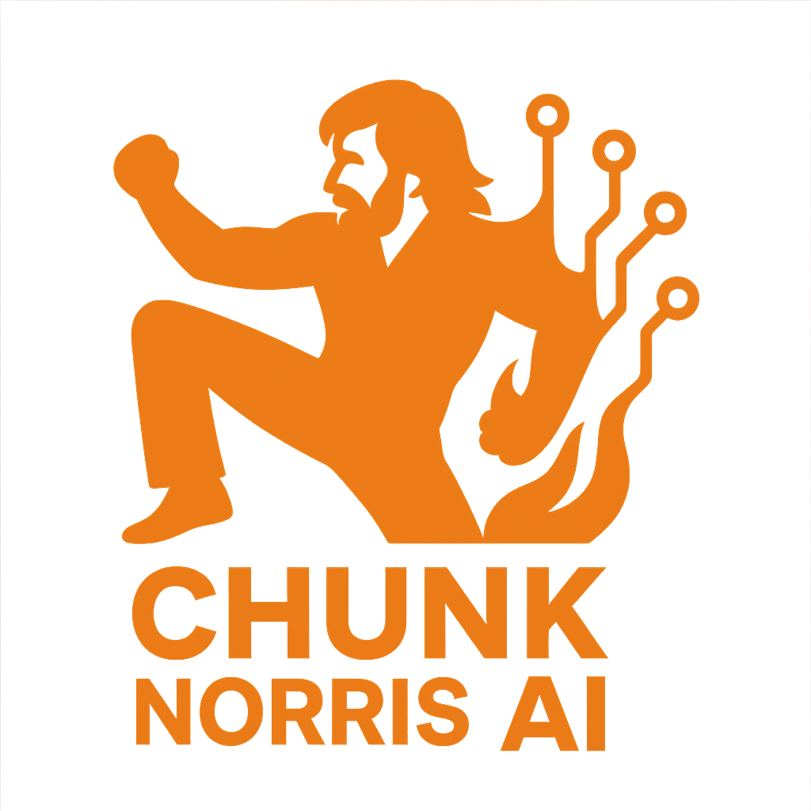

# Chunk Norris AI - Document Processing System

A powerful document processing system that converts various document formats to markdown, generates interactive visualizations, and provides AI-powered document analysis.



## 🌟 Features

### Core Features
- **Document Conversion**: Convert PDF, DOCX, RTF, and images to markdown
- **AI-Powered Processing**: Two processing modes available:
  - **Tesseract (OCR) & AI**: Uses Tesseract for text extraction and GPT-4o Mini for structure improvement
  - **Chunk Norris AI**: Direct AI interpretation of document content, bypassing OCR
- **Document Summary**: AI-generated concise summaries of document content
- **Interactive Visualizations**:
  - **Memory Graph**: Visual representation of document structure and relationships
  - **Ontology Graph**: Entity-relationship visualization using FalkorDB's GraphRAG-SDK

### Technical Features
- Parallel processing for improved performance
- Real-time document preview
- Interactive graph visualizations
- Responsive web interface
- RESTful API endpoints

## 🚀 Getting Started

### Prerequisites
- Python 3.8+
- Redis (for FalkorDB)
- OpenAI API key

### FalkorDB Setup (Required for Ontology Graph Feature)

1. Install Redis:
```bash
# Using Docker (recommended)
docker run -d -p 6379:6379 redis

# Or install Redis directly:
# macOS
brew install redis
brew services start redis

# Ubuntu/Debian
sudo apt-get install redis-server
sudo systemctl start redis-server

# Windows
# Download from https://github.com/microsoftarchive/redis/releases
```

2. Install FalkorDB:
```bash
pip install falkordb
```

3. Verify FalkorDB installation:
```bash
python -c "from falkordb import FalkorDB; db = FalkorDB(); print('FalkorDB connection successful!')"
```

For more detailed FalkorDB setup and configuration, visit the [official FalkorDB documentation](https://falkordb.com/docs).

### Installation

1. Clone the repository:
```bash
git clone https://github.com/yourusername/chunk-norris-ai.git
cd chunk-norris-ai
```

2. Create and activate a virtual environment:
```bash
python -m venv venv
source venv/bin/activate  # On Windows: venv\Scripts\activate
```

3. Install dependencies:
```bash
pip install -r requirements.txt
```

4. Set up environment variables:
```bash
cp .env.example .env
# Edit .env with your OpenAI API key and other configurations
```

5. Start Redis (required for FalkorDB):
```bash
# Using Docker
docker run -d -p 6379:6379 redis

# Or install and run Redis directly
# Follow instructions at https://redis.io/download
```

### Running the Application

1. Start the Flask server:
```bash
python app.py
```

Or use the provided start script:
```bash
./start.sh
```

2. Access the web interface:
```
http://localhost:8080
```


## 📊 Performance

The system uses parallel processing for:
- Document summary generation
- Memory graph generation
- Ontology graph generation

This significantly reduces processing time compared to sequential processing.

## 🎨 UI Features

- Drag-and-drop file upload
- Real-time document preview
- Interactive graph visualizations with:
  - Zoom controls
  - Node highlighting
  - Relationship exploration
  - Property inspection
- Dark mode graph visualization
- Responsive design

## 🔧 Configuration

Key configuration options in `.env`:
```
OPENAI_API_KEY=your_api_key_here
REDIS_HOST=127.0.0.1
REDIS_PORT=6379
FLASK_HOST=127.0.0.1
FLASK_PORT=8080
```

## 🤝 Contributing

1. Fork the repository
2. Create your feature branch (`git checkout -b feature/AmazingFeature`)
3. Commit your changes (`git commit -m 'Add some AmazingFeature'`)
4. Push to the branch (`git push origin feature/AmazingFeature`)
5. Open a Pull Request

## 📝 License

This project is licensed under the MIT License - see the [LICENSE](LICENSE) file for details.

## 🙏 Acknowledgments

- OpenAI for GPT-4o Mini
- FalkorDB for GraphRAG-SDK
- Tesseract OCR
- Flask framework
- ForceGraph for visualizations

## 📞 Support

For support, please open an issue in the GitHub repository or contact the maintainers.

---

Made with 💪 by Chunk Norris AI Team 